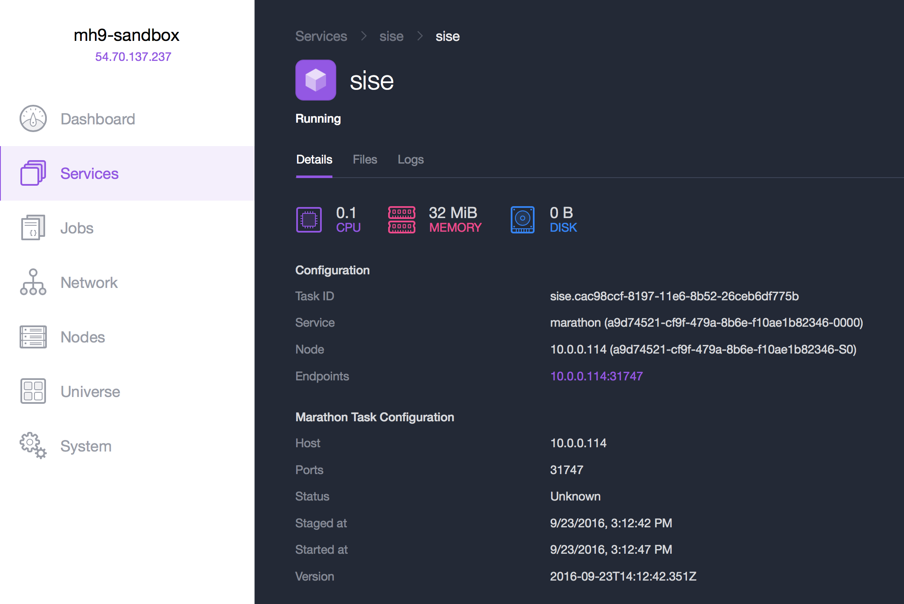
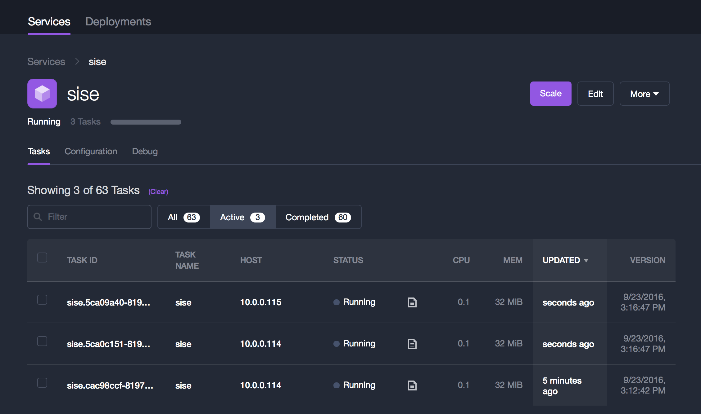
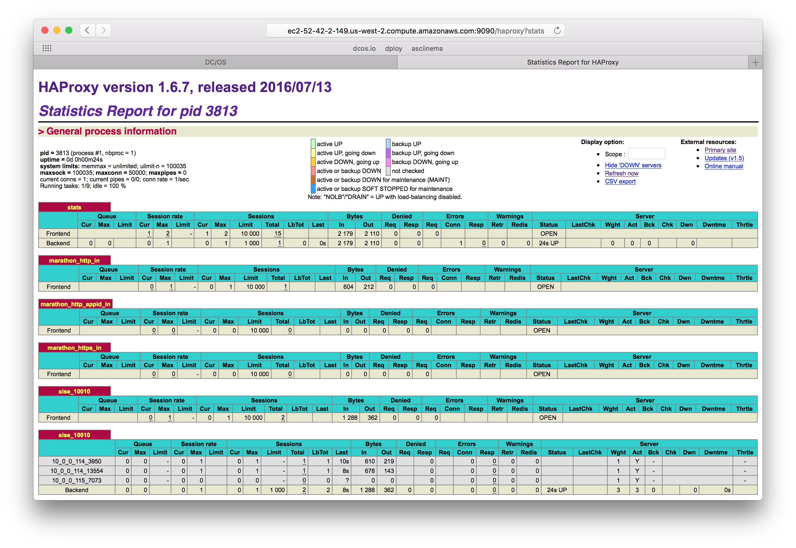

# DC/OS 103 - Service Discovery

Service Discovery is the process of finding out the `IP:PORT` combination a service is available from in a cluster of machines.
Mesos Master is the ultimate source of truth concerning this information and as such any Service Discovery (SD) mechanisms need
to consult it to learn about the mapping of a Mesos task (== service instance) to IP and port. 

In this lab we will deploy a simple service using a named [Virtual IP](https://dcos.io/docs/1.8/usage/service-discovery/load-balancing-vips/) (VIP), 
then we will then scale it and observe the automagic load-balancing and last but not least we will make the service publicly accessible.

## Setup

The [simple service](https://github.com/mhausenblas/simpleservice) we will be using in the following is written in Python and exposes only one endpoint, `/endpoint0`.
This endpoint responds with something like:

    {
        "host": "localhost:9876",
        "result": "all is well",
        "version": "0.3.0"
    }

Via the `host` field you can see from which machine the request came and the `version` field states the version of the service itself. Naturally, this is only a dummy service that does nothing useful, but it exposes the basic features needed for the following steps.

## Invoking the service within the cluster via a named VIP

The containerized version of the simple service is a Docker image available via [mhausenblas/simpleservice](https://hub.docker.com/r/mhausenblas/simpleservice/). This can be launched as a DC/OS service using the following specification:

    {
      "id": "/sise",
      "instances": 1,
      "cpus": 0.1,
      "mem": 32,
      "container": {
        "type": "DOCKER",
        "docker": {
          "image": "mhausenblas/simpleservice:0.3.0",
          "network": "HOST",
          "forcePullImage": true
        }
      },
      "portDefinitions": [
        {
          "labels": {
            "VIP_0": "/sise:80"
          }
        }
      ]
    }

Let's assume you've saved above specification in a file called `example-service.json`, then you can launch the service using the [DC/OS CLI](https://dcos.io/docs/1.8/usage/cli/) as follows:

    $ dcos marathon app add example-service.json

The result should be something like the following screen shot:

From within the cluster, for example via [SSHing](https://dcos.io/docs/1.8/administration/sshcluster/) into a master node, the simple service can be invoked like so:
    
    core@ip-10-0-5-223 ~ $ curl sise.marathon.l4lb.thisdcos.directory:80/endpoint0
    {"host": "sise.marathon.l4lb.thisdcos.directory", "version": "0.3.0", "result": "all is well"}

Note that no matter on which host and port the service actually runs, you can invoke it from anywhere within the cluster using `sise.marathon.l4lb.thisdcos.directory:80`.
To make the service listen to the random port assigned by DC/OS, I'm [passing in](https://github.com/mhausenblas/simpleservice/blob/master/simpleservice.py#L20) the special environment variable `PORT0`, which DC/OS automagically makes available in the task environment, to the service.

From anywhere where the [DC/OS CLI](https://dcos.io/docs/1.8/usage/cli/) is installed you can now see the result of the simple service being invoked:

    $ dcos task log --follow sise stderr
    I0923 14:12:46.683511 22454 exec.cpp:161] Version: 1.0.1
    I0923 14:12:46.687604 22463 exec.cpp:236] Executor registered on agent a9d74521-cf9f-479a-8b6e-f10ae1b82346-S0
    I0923 14:12:46.688691 22459 docker.cpp:815] Running docker -H unix:///var/run/docker.sock run --cpu-shares 102 --memory 33554432 -e MARATHON_APP_VERSION=2016-09-23T14:12:42.351Z -e HOST=10.0.0.114 -e MARATHON_APP_RESOURCE_CPUS=0.1 -e MARATHON_APP_RESOURCE_GPUS=0 -e MARATHON_APP_DOCKER_IMAGE=mhausenblas/simpleservice:0.3.0 -e PORT_10000=31747 -e MESOS_TASK_ID=sise.cac98ccf-8197-11e6-8b52-26ceb6df775b -e PORT=31747 -e MARATHON_APP_RESOURCE_MEM=32.0 -e PORTS=31747 -e MARATHON_APP_RESOURCE_DISK=0.0 -e MARATHON_APP_LABELS= -e MARATHON_APP_ID=/sise -e PORT0=31747 -e LIBPROCESS_IP=10.0.0.114 -e MESOS_SANDBOX=/mnt/mesos/sandbox -e MESOS_CONTAINER_NAME=mesos-a9d74521-cf9f-479a-8b6e-f10ae1b82346-S0.f19b3376-e999-41cd-9f00-12b9f7a01ae9 -v /var/lib/mesos/slave/slaves/a9d74521-cf9f-479a-8b6e-f10ae1b82346-S0/frameworks/a9d74521-cf9f-479a-8b6e-f10ae1b82346-0000/executors/sise.cac98ccf-8197-11e6-8b52-26ceb6df775b/runs/f19b3376-e999-41cd-9f00-12b9f7a01ae9:/mnt/mesos/sandbox --net host --name mesos-a9d74521-cf9f-479a-8b6e-f10ae1b82346-S0.f19b3376-e999-41cd-9f00-12b9f7a01ae9 mhausenblas/simpleservice:0.3.0
    2016-09-23T02:14:43 INFO /endpoint0 has been invoked from 10.0.5.223 [at line 35]
    2016-09-23T02:14:43 INFO 200 GET /endpoint0 (10.0.5.223) 1.08ms [at line 1946]
    2016-09-23T02:15:00 INFO /endpoint0 has been invoked from 10.0.5.223 [at line 35]
    2016-09-23T02:15:00 INFO 200 GET /endpoint0 (10.0.5.223) 0.66ms [at line 1946]

## Scaling the service

So far we had one instance of the simple service running. Next, we assume we want to serve more load and hence scale the simple service up to 3 instances:

When we now look at the logs again we see the automatic load balancing between the three tasks `sise.5ca09a40-8198-11e6-8b52-26ceb6df775b`, `sise.5ca0c151-8198-11e6-8b52-26ceb6df775b`, and `sise.cac98ccf-8197-11e6-8b52-26ceb6df775b` taking place: 

    $ dcos  log --follow sise stderr
    ===> task:sise.5ca09a40-8198-11e6-8b52-26ceb6df775b:stderr <===
    I0923 14:16:48.579545   448 exec.cpp:236] Executor registered on agent a9d74521-cf9f-479a-8b6e-f10ae1b82346-S2
    I0923 14:16:48.580734   447 docker.cpp:815] Running docker -H unix:///var/run/docker.sock run --cpu-shares 102 --memory 33554432 -e MARATHON_APP_VERSION=2016-09-23T14:16:47.027Z -e HOST=10.0.0.115 -e MARATHON_APP_RESOURCE_CPUS=0.1 -e MARATHON_APP_RESOURCE_GPUS=0 -e MARATHON_APP_DOCKER_IMAGE=mhausenblas/simpleservice:0.3.0 -e PORT_10000=29727 -e MESOS_TASK_ID=sise.5ca09a40-8198-11e6-8b52-26ceb6df775b -e PORT=29727 -e MARATHON_APP_RESOURCE_MEM=32.0 -e PORTS=29727 -e MARATHON_APP_RESOURCE_DISK=0.0 -e MARATHON_APP_LABELS= -e MARATHON_APP_ID=/sise -e PORT0=29727 -e LIBPROCESS_IP=10.0.0.115 -e MESOS_SANDBOX=/mnt/mesos/sandbox -e MESOS_CONTAINER_NAME=mesos-a9d74521-cf9f-479a-8b6e-f10ae1b82346-S2.07e049b6-201c-47dc-9228-fad4048e387d -v /var/lib/mesos/slave/slaves/a9d74521-cf9f-479a-8b6e-f10ae1b82346-S2/frameworks/a9d74521-cf9f-479a-8b6e-f10ae1b82346-0000/executors/sise.5ca09a40-8198-11e6-8b52-26ceb6df775b/runs/07e049b6-201c-47dc-9228-fad4048e387d:/mnt/mesos/sandbox --net host --name mesos-a9d74521-cf9f-479a-8b6e-f10ae1b82346-S2.07e049b6-201c-47dc-9228-fad4048e387d mhausenblas/simpleservice:0.3.0
    2016-09-23T02:17:48 INFO /endpoint0 has been invoked from 10.0.5.223 [at line 35]
    2016-09-23T02:17:48 INFO 200 GET /endpoint0 (10.0.5.223) 1.12ms [at line 1946]
    2016-09-23T02:19:18 INFO /endpoint0 has been invoked from 10.0.5.223 [at line 35]
    2016-09-23T02:19:18 INFO 200 GET /endpoint0 (10.0.5.223) 0.61ms [at line 1946]
    2016-09-23T02:19:20 INFO /endpoint0 has been invoked from 10.0.5.223 [at line 35]
    2016-09-23T02:19:20 INFO 200 GET /endpoint0 (10.0.5.223) 0.56ms [at line 1946]
    2016-09-23T02:25:07 INFO /endpoint0 has been invoked from 10.0.5.223 [at line 35]
    2016-09-23T02:25:07 INFO 200 GET /endpoint0 (10.0.5.223) 0.65ms [at line 1946]
    ===> task:sise.5ca0c151-8198-11e6-8b52-26ceb6df775b:stderr <===
    2016-09-23T02:19:22 INFO /endpoint0 has been invoked from 10.0.5.223 [at line 35]
    2016-09-23T02:19:22 INFO 200 GET /endpoint0 (10.0.5.223) 0.87ms [at line 1946]
    2016-09-23T02:24:56 INFO /endpoint0 has been invoked from 10.0.5.223 [at line 35]
    2016-09-23T02:24:56 INFO 200 GET /endpoint0 (10.0.5.223) 0.67ms [at line 1946]
    2016-09-23T02:25:00 INFO /endpoint0 has been invoked from 10.0.5.223 [at line 35]
    2016-09-23T02:25:00 INFO 200 GET /endpoint0 (10.0.5.223) 0.65ms [at line 1946]
    2016-09-23T02:25:01 INFO /endpoint0 has been invoked from 10.0.5.223 [at line 35]
    2016-09-23T02:25:01 INFO 200 GET /endpoint0 (10.0.5.223) 0.68ms [at line 1946]
    2016-09-23T02:25:06 INFO /endpoint0 has been invoked from 10.0.5.223 [at line 35]
    2016-09-23T02:25:06 INFO 200 GET /endpoint0 (10.0.5.223) 0.65ms [at line 1946]
    ===> task:sise.cac98ccf-8197-11e6-8b52-26ceb6df775b:stderr <===
    2016-09-23T02:19:17 INFO /endpoint0 has been invoked from 10.0.5.223 [at line 35]
    2016-09-23T02:19:17 INFO 200 GET /endpoint0 (10.0.5.223) 0.59ms [at line 1946]
    2016-09-23T02:25:02 INFO /endpoint0 has been invoked from 10.0.5.223 [at line 35]
    2016-09-23T02:25:02 INFO 200 GET /endpoint0 (10.0.5.223) 0.60ms [at line 1946]
    2016-09-23T02:25:03 INFO /endpoint0 has been invoked from 10.0.5.223 [at line 35]
    2016-09-23T02:25:03 INFO 200 GET /endpoint0 (10.0.5.223) 0.63ms [at line 1946]
    2016-09-23T02:25:05 INFO /endpoint0 has been invoked from 10.0.5.223 [at line 35]
    2016-09-23T02:25:05 INFO 200 GET /endpoint0 (10.0.5.223) 0.58ms [at line 1946]
    2016-09-23T02:25:30 INFO /endpoint0 has been invoked from 10.0.5.223 [at line 35]
    2016-09-23T02:25:30 INFO 200 GET /endpoint0 (10.0.5.223) 0.59ms [at line 1946]
    ===> task:sise.5ca09a40-8198-11e6-8b52-26ceb6df775b:stderr <===
    2016-09-23T02:25:33 INFO /endpoint0 has been invoked from 10.0.5.223 [at line 35]
    2016-09-23T02:25:33 INFO 200 GET /endpoint0 (10.0.5.223) 0.63ms [at line 1946]
    2016-09-23T02:25:35 INFO /endpoint0 has been invoked from 10.0.5.223 [at line 35]
    2016-09-23T02:25:35 INFO 200 GET /endpoint0 (10.0.5.223) 0.62ms [at line 1946]
    ===> task:sise.5ca0c151-8198-11e6-8b52-26ceb6df775b:stderr <===
    2016-09-23T02:25:38 INFO /endpoint0 has been invoked from 10.0.5.223 [at line 35]
    2016-09-23T02:25:38 INFO 200 GET /endpoint0 (10.0.5.223) 0.86ms [at line 1946]

## Exposing the service to the Web using Marathon-LB

So far we were able to access the simple service from within the cluster, for example, from another service or manually as we did above using `curl`. Now we want to make the service available to the public.

To expose the simple service to the Web, we use [Marathon-LB](https://dcos.io/docs/1.8/usage/service-discovery/marathon-lb/). First we install MLB, see also the [docs](https://dcos.io/docs/1.8/usage/service-discovery/marathon-lb/usage/) for further options:

    $ dcos package install marathon-lb

To expose the simple service you only need to add two labels, `HAPROXY_GROUP` and `HAPROXY_0_VHOST` (set it to the public agent host) and define a port, `10010` in our case:

    {
      "id": "/sise",
      "instances": 3,
      "cpus": 0.1,
      "mem": 32,
      "container": {
        "type": "DOCKER",
        "docker": {
          "image": "mhausenblas/simpleservice:0.3.0",
          "network": "HOST",
          "forcePullImage": true
        }
      },
      "labels": {
        "HAPROXY_GROUP": "external",
        "HAPROXY_0_VHOST": "http://ec2-52-42-2-149.us-west-2.compute.amazonaws.com"
      },
      "portDefinitions": [{
        "port": 10010,
        "labels": {
          "VIP_0": "/sise:80"
        }
      }]
    }

Now we can deploy the simple service again:

    $ dcos marathon app add example-service-external.json

And list all of the tasks that currently run (we expect MLB and three instances of our simple service):

    $ dcos task
    NAME         HOST        USER  STATE  ID
    marathon-lb  10.0.4.224  root    R    marathon-lb.dd8c87c5-819a-11e6-8b52-26ceb6df775b
    sise         10.0.0.114  root    R    sise.1417e3b9-819c-11e6-8b52-26ceb6df775b
    sise         10.0.0.114  root    R    sise.d45af1db-819c-11e6-8b52-26ceb6df775b
    sise         10.0.0.115  root    R    sise.d45acaca-819c-11e6-8b52-26ceb6df775b

Now, MLB uses HAProxy on a public node to expose services to the public:

As a result of using MBL we can now invoke our simple service from anywhere on the Internet:

    $ http http://ec2-52-42-2-149.us-west-2.compute.amazonaws.com:10010/endpoint0
    HTTP/1.1 200 OK
    Content-Length: 110
    Content-Type: application/json
    Date: Fri, 23 Sep 2016 14:46:54 GMT
    Etag: "d9ba10b4a90ac72d4578dab377b010ccfaaaaef5"
    Server: TornadoServer/4.3
    
    {
        "host": "ec2-52-42-2-149.us-west-2.compute.amazonaws.com:10010",
        "result": "all is well",
        "version": "0.3.0"
    }

Summing up, we exposed and invoked a simple service using VIPs and MLB with a few configuration settings necessary and most of the heavy lifting taking care of by DC/OS.
