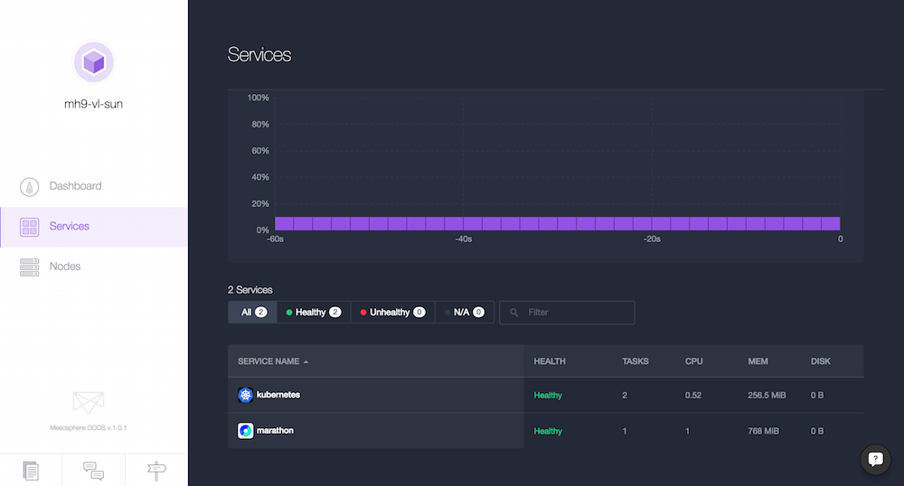

# Container management with Docker, Mesos/Marathon and Kubernetes

## Contents

Training session at [Velocity NYC, 2015](http://velocityconf.com/devops-web-performance-ny-2015/public/schedule/detail/44830).

See the [slide deck](https://speakerdeck.com/mhausenblas/marathon-and-kubernetes) for background on containers, Docker, Mesos/Marathon, Kubernetes and further resources.

First you want to install the [DCOS CLI](https://docs.mesosphere.com/install/cli/) and clone this repo in the directory where you've installed the CLI. For example, I've installed the CLI into `~/sandbox/dcos/ccm/dcos` hence I would do the following:

    $ pwd
    /Users/mhausenblas/sandbox/dcos/ccm/dcos
    $ git clone https://github.com/mesosphere/velocity-training.git
    $ ls -al
    total 24
    drwxr-xr-x  6 mhausenblas  staff   306B 12 Oct 06:31 .
    drwxr-xr-x  5 mhausenblas  staff   272B 12 Oct 06:13 ..
    lrwxr-xr-x  1 mhausenblas  staff    78B 12 Oct 06:13 .Python -> /usr/local/Cellar/python/2.7.9/Frameworks/Python.framework/Versions/2.7/Python
    drwxr-xr-x  2 mhausenblas  staff   1.3K 12 Oct 06:13 bin
    drwxr-xr-x  2 mhausenblas  staff   102B 12 Oct 06:13 include
    -rw-r--r--  1 mhausenblas  staff   2.2K 12 Oct 06:13 install.sh
    drwxr-xr-x  3 mhausenblas  staff   102B 12 Oct 06:13 lib
    -rw-r--r--  1 mhausenblas  staff    60B 12 Oct 06:13 pip-selfcheck.json
    drwxr-xr-x  7 mhausenblas  staff   272B 12 Oct 06:31 velocity-training

Going forward, we will call the directory you've installed the DCOS CLI in simply `$DCOS_CLI_HOME`.

Now check if you can access the DCOS cluster dashboard and you're all set:

The hands on sessions are:

1. [Containers &amp; Docker](./docker)
1. [Mesos &amp; Marathon](./mesos-marathon)
1. [Kubernetes](./kubernetes)
1. [Putting It All Together](./piat)

## Resources

- [DCOS doc](https://docs.mesosphere.com)
- [Docker doc](https://docs.docker.com/)
- [Mesos doc](http://mesos.apache.org/documentation/latest/) | [Marathon doc](https://mesosphere.github.io/marathon/docs/)
- [Kubernetes doc](http://kubernetes.io/v1.0/)

