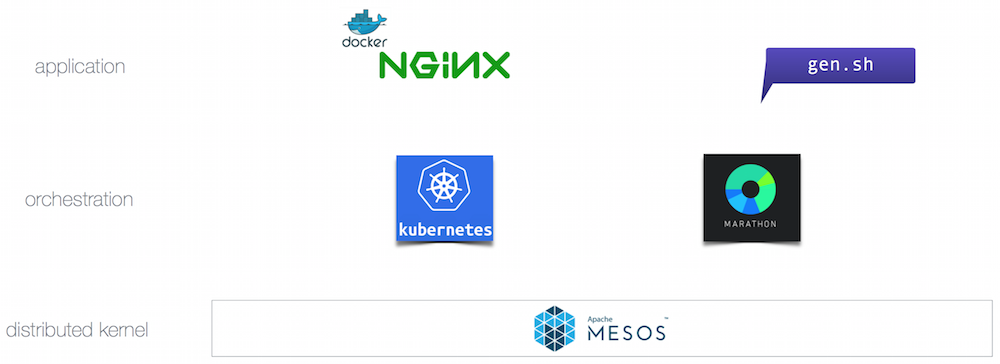

# Putting it all together

## Setup

Fill in with your own coordinates:

    Dashboard: http://
    Master IP:
    Public Slave: http://
    KubeUI: http://$DCOS_DASHBOARD_FQHN/service/kubernetes/api/v1/proxy/namespaces/kube-system/services/kube-ui/

## Example: a hybrid workload

We will create a simple hybrid app, consisting of a Kubernetes part and a Marathon part:

Do the steps as outlined below and pay attention to figuring out the IP of host Kubernetes schedules the nginx pod on, since you'll need to change `marathon-gen.json` in the following way:

    ...
    "constraints": [
        [
            "hostname",
            "LIKE",
            "ip-10-0-0-202.eu-west-1.compute.internal"
        ]
    ]
    ...

Change the value of `ip-10-0-0-202.eu-west-1.compute.internal` to whatever the FQHN of the Kubernetes host is you've discovered.

    $ cd $DCOS_CLI_HOME
    $ dcos package list
    # launch the Kubernetes part:
    $ kubectl create -f velocity-training/piat/k8s-webserver-pod.json
    $ kubectl get pods
    $ kubectl create -f velocity-training/piat/k8s-webserver-service.json
    $ kubectl get services
    # launch the Marathon part (note the IP address of the nginx service and change constraint in marathon-gen.json):
    $ dcos marathon app add velocity-training/piat/marathon-gen.json
    $ dcos marathon app list
    $ kubectl delete service nginx-service
    $ kubectl delete pod nginx

Todo:

- to discovery the internal IP, do `kubectl get endpoints`
- ssh into agent where K8S has scheduled the pod and do `hostname`
- to view content on local browser, do `ssh -D 6996 -A core@54.165.181.143` and configure SOCKS proxy 

## Further resources

- https://mesosphere.com/blog/2015/06/21/web-application-analytics-using-docker-and-marathon/
- https://github.com/mhausenblas/ntil
- http://kubernetes.io/v1.0/docs/design/architecture.html
- https://github.com/kubernetes/kubernetes/blob/release-1.0/contrib/mesos/docs/architecture.md
- https://github.com/jeffmendoza/kubernetes/blob/gh-pages/solutions/mesosphere.md
