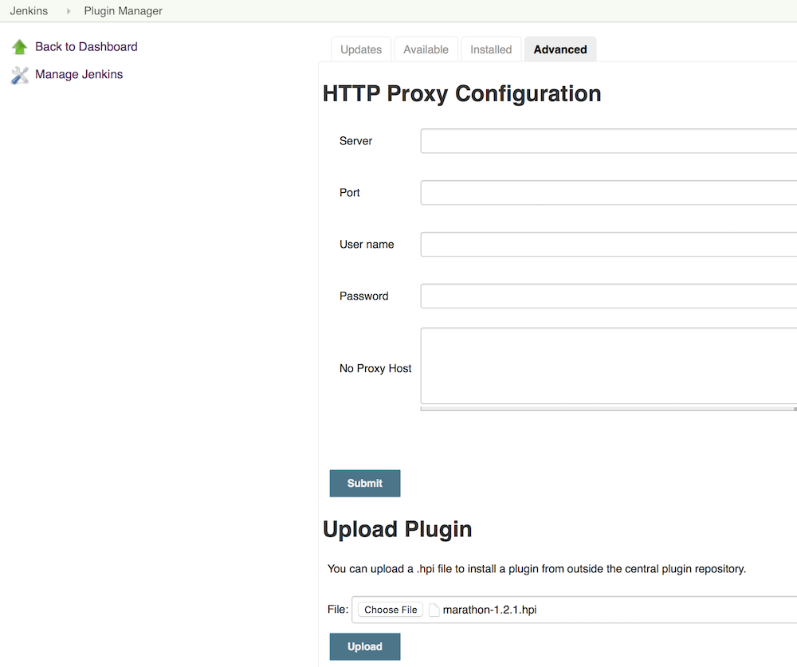
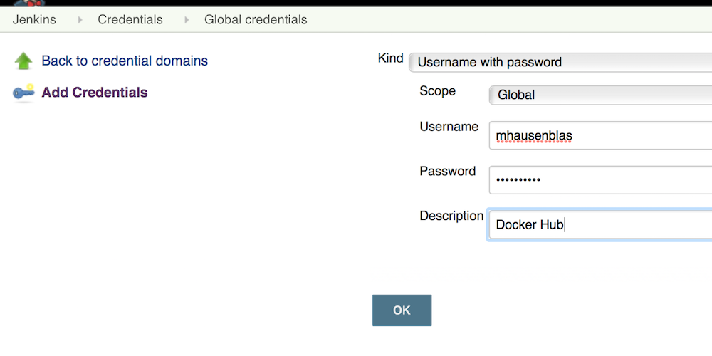
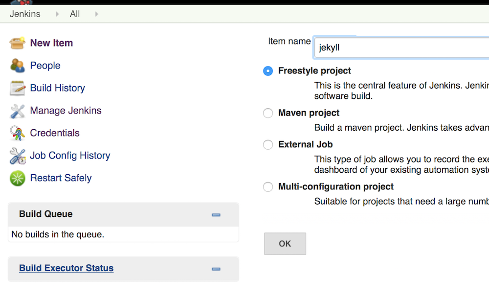
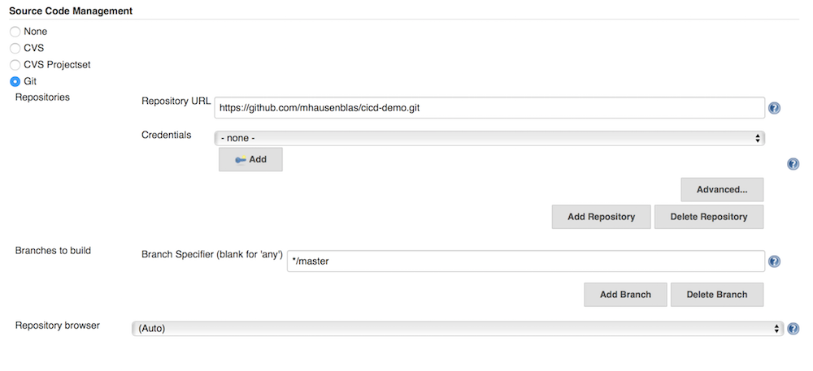
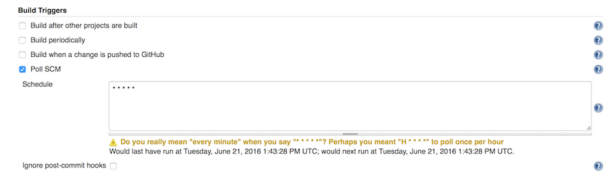
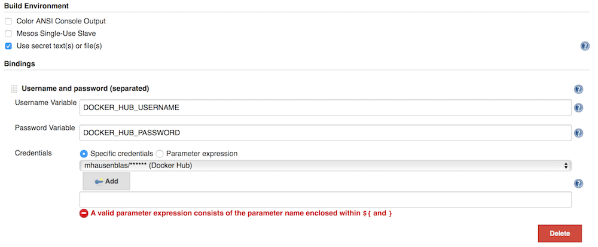
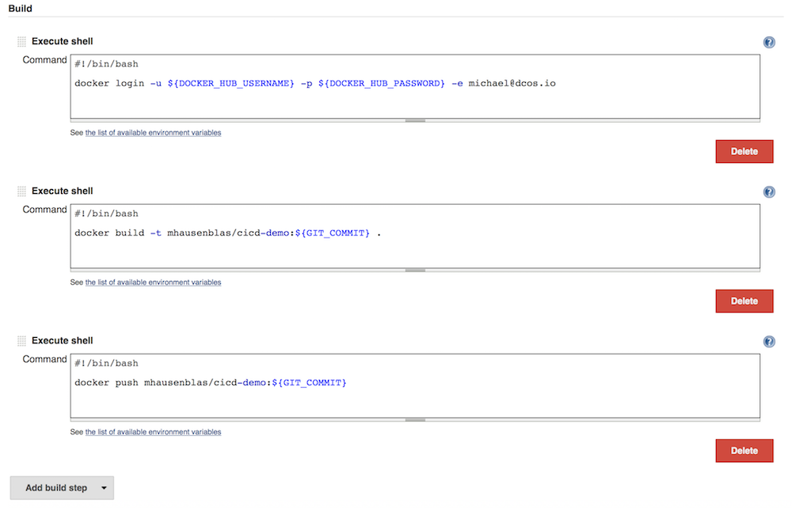
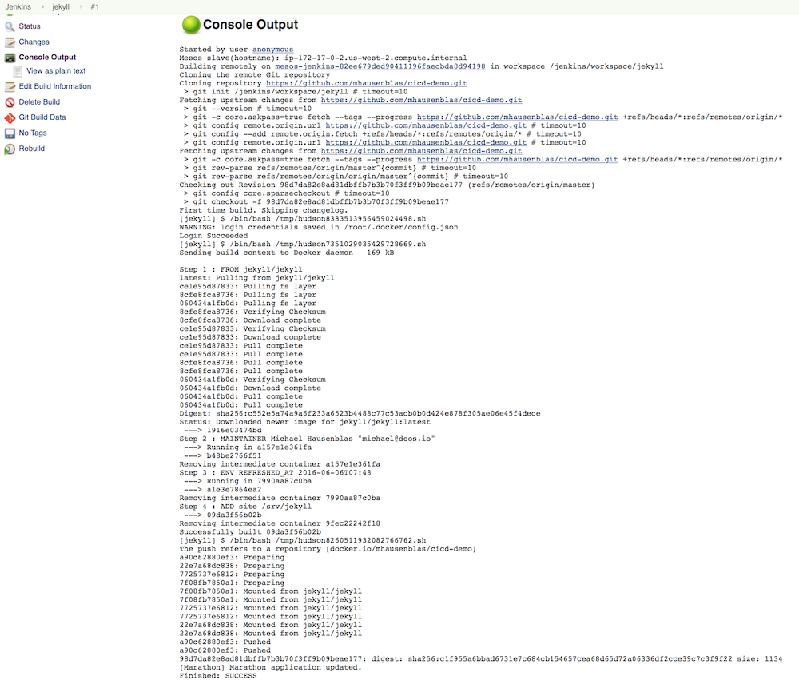
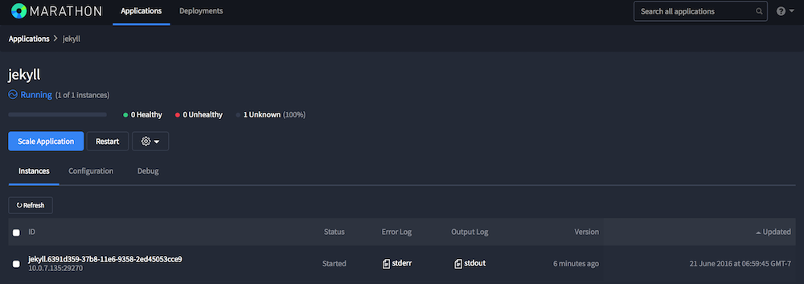
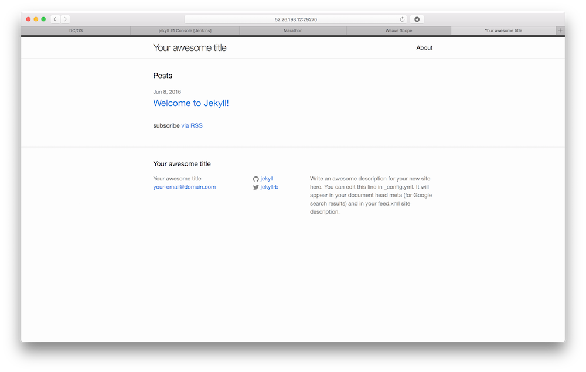

# Continuous Integration/Continuous Delivery

The goal of this session is to use Jenkins on DC/OS to set up a simple CI/CD pipeline that builds an application (a blog) and deploys using Marathon.

In order to carry out the hands-on, at least one member in the team will need:

1. A [GitHub](github.com) account
2. A [Docker Hub](https://hub.docker.com/) account


## Preparation
### Installing  Jenkins

We're going to install an instance of Jenkins onto DC/OS. The Jenkins package for DC/OS is available in the [Mesosphere Universe](https://github.com/mesosphere/universe). 

Install Jenkins using the DC/OS CLI:
```
dcos package install jenkins
```

Wait a few minutes and the Jenkins instance should come up and be available via the Services tab.

Note that if you want individual Jenkins instances per team member, that's also possible by installing Jenkins either via the `Advanced Installation` option in the DC/OS Dashboard or via using `--options=config.json` argument with above command. See also the [docs](https://dcos.io/docs/1.7/usage/tutorials/jenkins/#installing-jenkins-in-a-development-environment) for further details.

### Installing the Marathon plugin

The [Marathon plugin for Jenkins](https://github.com/mesosphere/jenkins-marathon-plugin/releases) provides an easy way to deploy an application to Marathon. The `marathon-1.2.1.hpi` file in this directory is the current version of the plugin; to install it, go to the Jenkins plugin manager (via the `Manage Jenkins` menu item on the left) and install via the `Advanced` tab:



## Setting up your project

Begin by creating a new public GitHub repository, e.g. [mhausenblas/cicd-demo](https://github.com/mhausenblas/cicd-demo). Initialise this with a README and clone it to your machine. When this is done, you can either generate a new site from scratch or re-use our existing site.

### a) Creating a Jekyll site from scratch

Follow [the instructions provided by GitHub](http://www.stephaniehicks.com/githubPages_tutorial/pages/githubpages-jekyll.html) to create a basic site outline:

    $ gem install bundler
    $ gem install jekyll
    $ jekyll new site

Now add these files to your repository:

    $ git add site/*
    $ git commit -m "inits site"
    $ git push

### b) Re-using a Jekyll site

Clone https://github.com/mhausenblas/cicd-demo and copy the entire `site` folder over to your repo and push this to your repository:

    $ git add site/*
    $ git commit -m "inits site"
    $ git push

### Creating a Docker Hub repo

Create a new public DockerHub repository, e.g. [mhausenblas/cicd-demo](https://hub.docker.com/r/mhausenblas/cicd-demo/).

### Creating a Dockerfile

Let's create a very simple `Dockerfile` that reuses a Jekyll base image and adds our files to it:

    FROM jekyll/jekyll
    ADD site /srv/jekyll

Commit and push this file:

    $ git add Dockerfile
    $ git commit -m "adds Dockerfile"
    $ git push

### Creating a Marathon app spec

Now we'll add a Marathon app spec to declare how we want to run the blog. For that, create a `blog.json` in the root of your GitHub repo and add the following JSON into it. You can also re-use the existing [jekyll.json](https://github.com/mhausenblas/cicd-demo/blob/master/jekyll.json).

NOTE: don't forget to change the Docker image to point to **your** newly created Docker Hub repository!

```json
{
  "id": "myblog",
  "container": {
    "type": "DOCKER",
    "docker": {
      "image": "mhausenblas/cicd-demo:latest",
      "network": "BRIDGE",
      "portMappings": [
        {
          "containerPort": 4000,
          "hostPort": 0
        }
      ]
    }
  },
  "acceptedResourceRoles": [
    "slave_public"
  ],
  "labels": {
    "lastChangedBy": "michael@dcos.io"
  },
  "instances": 1,
  "cpus": 0.1,
  "mem": 128,
  "healthChecks": [
    {
      "protocol": "TCP",
      "gracePeriodSeconds": 200,
      "intervalSeconds": 30,
      "portIndex": 0,
      "timeoutSeconds": 10,
      "maxConsecutiveFailures": 2
    }
  ],
  "upgradeStrategy": {
    "minimumHealthCapacity": 0
  }
}
```

Commit and push the Marathon app spec:

    $ git add blog.json
    $ git commit -m "adds Marathon app spec"
    $ git push

## Setting up a pipeline

We will create a couple of jobs that depend on each other to create a basic build and deploy pipeline.

### Adding credentials

Go to the `Credentials` link on the left hand side, click on `Global credentials` and again on `Add Credentials`. Put your Docker Hub credentials in there:



### Building Jekyll

Go back to Jenkins main dashboard and click on the `New Item` link. Create a `Freestyle project` and give it a meaningful name.



We'll set up our GitHup repo; make sure you use the HTTPS URL (for example, `https://github.com/mhausenblas/cicd-demo.git`)



Then, let's set up Jenkins to poll the repo using the `* * * * *` schedule (which will poll every minute):



Now we need to bind our username and password to environment variables.



Next, add three `Execute shell` build steps to login, build and push the image respectively. We will tag the Docker image with the Git commit SHA (Step 2). 

Step 1:

    #!/bin/bash
    docker login -u ${DOCKER_HUB_USERNAME} -p ${DOCKER_HUB_PASSWORD} -e michael@dcos.io

Step 2:

    #!/bin/bash
    docker build -t mhausenblas/cicd-demo:${GIT_COMMIT} .

Step 3:

    #!/bin/bash
    docker push mhausenblas/cicd-demo:${GIT_COMMIT}



Finally, let's add a post-build action of type `Marathon Deployment`. We'll use the internal IP address of the System Marathon, that is `http://leader.mesos:8080/`, for the `Marathon URL` field, the Marathon app spec file (in my case `jekyll.json`) for the `Application Definition` field and `${JOB_NAME}` for the `Application Id` field. Use your own Docker image for the `Docker Image` field (for me: `mhausenblas/cicd-demo:${GIT_COMMIT}`)


Hit the `Save` button at the bottom and within the next minute Jenkins will automatically build and deploy your project for the first time. Note: if you've already saved it, you'll need to hit `Build now` or commit a change to your GitHub repo for Jenkins to build the project again.

When the build is completed you should see something like the following:



## Accessing Jekyll

The Marathon app spec we used deploys Jekyll to the public node. You can check the status of the deployment from the dashboard of the System Marathon.



To access Jekyll, look up the port in Marathon (in my case `29270`) and append to the public node FQDN or IP:


 