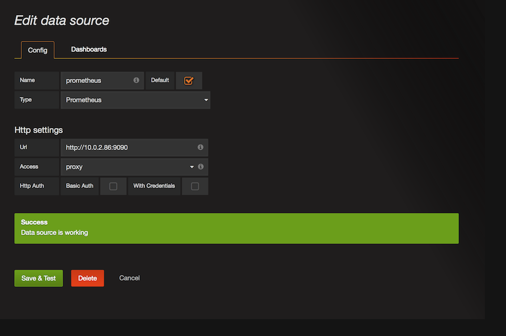
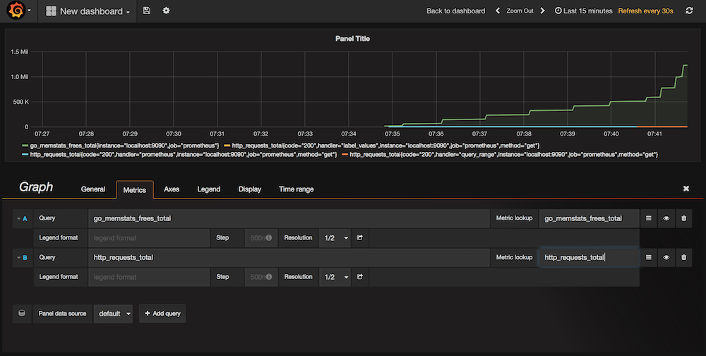

# Monitoring

The goal of this session is to set up a basic monitoring infrastructure using [Prometheus](https://prometheus.io/) and [Grafana](http://grafana.org/).

Note that in order for the following to work you need to have [Marathon-lb](https://dcos.io/docs/1.7/usage/service-discovery/marathon-lb/) installed.

## Preparation

Deploy first Prometheus using the app spec [here](prometheus.json): 

    $ dcos marathon app add prometheus.json

Once Prometheus is up and running, deploy Grafana with the respective app spec, [here](grafana.json) as well:

    $ dcos marathon app add grafana.json

## Connecting Grafana to Prometheus

In order to render graphs in Grafana, you'll have to configure a data source like shown below (you will have to discover where Prometheus runs first for this):

## Creating a dashboard

Once the data source is configured you can create a dashboard, for example like so:

