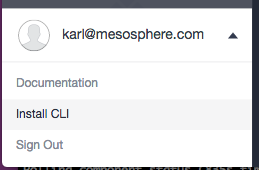

# DC/OS 102 - CLI

The DC/OS CLI is the primary programmatic control interface for observing and managing your cluster.

## Agenda

- [Install](#install)
- [Log In](#log-in)
- [Create Service](#create-service)
- [Locate Service Endpoint](#locate-service-endpoint)
- [Destroy Service](#destroy-service)

## Install

Follow the platform-specific instructions in the UI for installing and configuring the CLI.



Use the Linux instructions if you're SSHed into a Linux VM.

TODO: do the Windows instructions work in GitBash?

## Log in

```
$ dcos auth login
```

Follow instructions to retrieve OAuth token via a browser.

## Create Service

Install MinitTwit as a new Service.

TODO: instructions

```
{
  "id": "/minitwit",
  "instances": 1,
  "cpus": 1,
  "mem": 256,
  "container": {
    "docker": {
      "image": "karlkfi/minitwit",
      "forcePullImage": false,
      "privileged": false,
      "portMappings": [
        {
          "hostPort": 80,
          "containerPort": 80,
          "protocol": "tcp"
        }
      ],
      "network": "BRIDGE"
    }
  },
  "acceptedResourceRoles": [
    "slave_public"
  ],
  "requirePorts": true
}
```

## Locate Service Endpoint

TODO: instructions

## Destroy Service

TODO: instructions

## Next Up

[DC/OS 103 - Health Checks & SSH](dcos-103.md)
