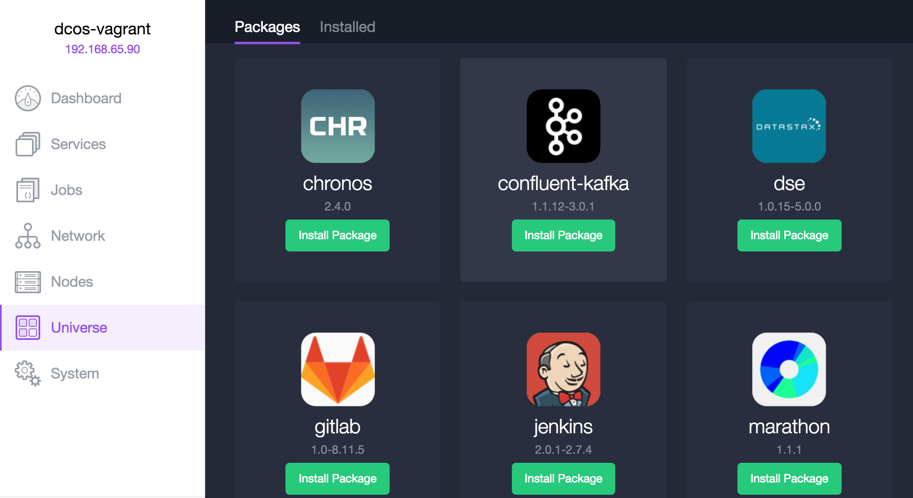

# DC/OS 104 - Packages & Scaling

## Agenda

- [Install MySQL](#install-mysql)
- [Configure Service to Use MySQL](#configure-service-to-use-mysql)
- [Service Suspension](#service-suspension)
- [Load Balancing with Marathon\-LB](#load-balancing-with-marathon-lb)
- [Service Scaling](#service-scaling)
- [Scalable Big Data](#scalable-big-data)



## Install MySQL


The MySQL universe package is a fairly simple package. It's just MySQL running in a docker container with a package that defines domain-specific configuration, using a template to generate a DC/OS service definition.

To install it from the GUI:

1. Select `Universe` in the left navigation panel to access the package list page
1. Type `MySQL` into the search box to filter the packages.
1. Select `Install`, next to the MySQL package, to open the package install screen
1. Select `Advanced Installation` to open the package configuration screen
1. On the `mysql` tab, under `root_password`, enter a password (e.g. `root`)
1. On the `mysql` tab, under `name`, enter the name of a database to create on installation (e.g. `minitwit`)
1. On the `mysql` tab, under `username`, enter the name of a user to create with access to the database (e.g. `minitwit`)
1. On the `mysql` tab, under `password`, enter a password to assign to the new user (e.g. `minitwit`)
1. Select `Review and Install` to open the package review page
1. Select `Install` to install the package and create a DC/OS service

Packages may *alternatively* be installed with the DC/OS CLI, using a JSON configuration file.

```
cat > pkg-mysql.json << EOF
{
  "service": {
    "name": "mysql"
  },
  "mysql": {
    "root_password": "root",
    "database": {
      "name": "minitwit",
      "username": "minitwit",
      "password": "minitwit"
    }
  }
}
EOF

dcos package install mysql --options=pkg-mysql.json
```

Once installed, running, and ready, MySQL should be reachable inside the cluster via DNS at `mysql.marathon.mesos:3306`.

## Configure Service to Use MySQL

By default, the MiniTwit service used in [DC/OS 103](dcos-103.md#readiness-checks) creates and uses an in-memory HyperSQL database (HSQLDB), but it can also be configured to use an external MySQL to preserve its data.

To configure MiniTwit to use MySQL, a few environment variables need to be configured in the MiniTwit service definition:

```
"env": {
  "SPRING_DATASOURCE_URL": "jdbc:mysql://mysql.marathon.mesos:3306/minitwit?autoReconnect=true&useSSL=false",
  "SPRING_DATASOURCE_USERNAME": "minitwit",
  "SPRING_DATASOURCE_PASSWORD": "minitwit",
  "SPRING_DATASOURCE_DRIVER-CLASS-NAME": "com.mysql.cj.jdbc.Driver",
  "SPRING_DATASOURCE_PLATFORM": "mysql"
}
```

These are standard Spring JDBC environment variables used to specify a DataSource. Spring will auto-generate the appropriate DataSource object and inject it into classes that require one.

The updated service definition can be used to create a new MiniTwit service or update one that is already running.

## Service Suspension

As with most applications using an external database, MiniTwit can now be stopped and restarted without losing data.

To stop a DC/OS service:

1. Select `Services` in the left navigation panel to access the service list page
1. Hover over the name of the deployed service (e.g. `minitwit`) to show the service actions button
1. Select the service actions button to show a dropdown of service actions
1. Select `Suspend` to show the confirmation dialog
1. Select `Suspend Service` to scale the service down to zero instances


Scaling to zero instances will gracefully terminate (TERM signal) all running instances, killing them (KILL signal) if graceful termination takes longer than the configured `taskKillGracePeriodSeconds`.

Once suspended, a service can be restarted by scaling it up to the desired number of instances.

## Load Balancing with Marathon-LB

With externalized data storage, carefully designed (cloud native) web applications can be horizontally scaled to handle more traffic.

To scale a service, a load balancer is generally required, to feed incoming traffic to a service with capacity to handle it.

Marathon-LB is the standard reverse proxy used with DC/OS to expose public services.
It works by watching Marathon state changes and updating HAProxy to match.
It runs on a DC/OS **public agent node** and is itself scheduled by Marathon.

Marathon-LB can be installed as DC/OS package from the Mesosphere Universe:

```
dcos package install marathon-lb
```


Since Marathon-LB can handle proxying a large number of services, it is allocated most of the open ports on the public agent node, including 80 (HTTP) and 443 (HTTPS). So it may fail to deploy if your public nodes already have ports allocated to other services.

To configure a service to use Marathon-LB:

1. Configure the service to run on a private agent node with a random host port:

    These settings are default behavior, but were set with explicit values in the MiniTwit example. Change or just remove them.

    Set the host port to zero:

    ```
    "container": {
      ...
      "docker": {
        ...
        "portMappings": [
          {
            ...
            "hostPort": 0,
          }
        ]
      }
    }
    ```

    Disable host port requirement:

    ```
    "requirePorts": false
    ```

    Remove the resource role requirement:

    ```
    "acceptedResourceRoles": null
    ```

1. Add a `servicePort` in the port mapping of a specific port:

   ```
   "container": {
     ...
     "docker": {
       ...
       "portMappings": [
         {
           ...
           "servicePort": 80
         }
       ]
     }
   }
   ```

   The service port should be set to the port to expose on the public agent node.

1. Label the service as external:

    ```
    "labels":{
      "HAPROXY_GROUP": "external"
    }
    ```

Once both the service and Marathon-LB are created/updated, running, and healthy, the service should be accessible on the public agent node via the specified service port.

On AWS, the public agent nodes are given their own Elastic Load Balancer (ELB).
If there is only one public agent node, the ELB can be used to access Marathon-LB.

Otherwise, to find the Marathon-LB endpoint according to the cluster, use the dcos CLI (or web GUI or Marathon API):

```
# TODO: update for AWS
$ dcos marathon app show marathon-lb | jq -r .tasks[].host
172.17.0.6
```

To see this in action, modify the MiniTwit service definition from [DC/OS 103](dcos-103.md#readiness-checks) to use Marahton-LB and expose port 80 as external. Then use the public slave IP, address, or ELB to reach MiniTwit from your local machine.

## Service Scaling

Now that MiniTwit is behind a load balancer, it can be scaled to an arbitrary number of instances to handle planned load.


Scaling a service is simple in DC/OS:

1. Select `Services` in the left navigation panel to access the service list page
1. Hover over the name of the deployed service (e.g. `minitwit`) to show the service actions button
1. Select the service actions button to show a dropdown of service actions
1. Select `Scale` to show the confirmation dialog
1. Enter the number of service instances to deploy in total (e.g. `3`)
1. Select `Scale Service` to start the deployment of new service instances


Now, when accessing the service via the public slave, Marathon-LB will round robin between the healthy service instances!

If any of the service instances crash or become unreachable, Marathon-LB will remove them from load balancing ring automatically so that users are (almost) always sent to a healthy service instance.

## Scalable Big Data

Ideally, the data storage service would also be able to be scaled horizontally. In this case the MySQL database package chosen only supports a single instance. However, there are a several methods of horizontally scaling SQL databases. Hopefully those packages will be available as DC/OS packages soon!

For real big data needs, try Cassandra! Cassandra is a NoSQL database designed for horizontal scaling. See the [IOT Pipeline tutorial](https://docs.mesosphere.com/1.8/usage/tutorials/iot_pipeline/) for an example use case.

## Next Up

[DC/OS 105 - Networking & Service Discovery](dcos-105.md)
