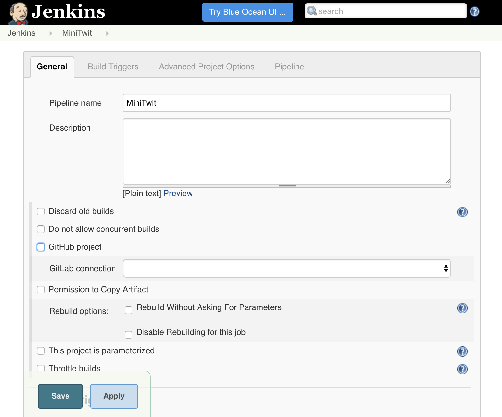

# Jenkins 102 - Pipelines

A recent addition to Jenkins is the pipeline plugin.
This plugin allows for creating groovy scripts that orchestrate a potentially complex series of optionally parallel build stages.

For this lab, we'll be making a pipeline to build and test MiniTwit.


1. Select `New Item` in the left nav to open the project creation page
1. Enter a project name into the test field (e.g. `MiniTwit`)
1. Select `Pipeline` and `OK` to create the project and open the job configuration page



Now that the pipeline is created, it needs to be configured.

1. Select `GitHub Project` to show the GitHub config section
1. Under `GitHub Project`, enter the `Project url` (e.g. `http://github.com/karlkfi/minitwit`)
1. Under `Pipeline`, enter a groovy pipeline script to execute:

    ```
    echo 'Hello World!'
    ```
1. Select `Save` to confirm config changes and open the project detail page

Now that the pipeline is configured, it can be run!

1. Select `Build Now` in the left nav to add a build to the queue

    The build should immediately show up under `Build History`.
    Once the build has started, a progress bar will appear next to the build number in the build history.
1. Select the progress bar to open the build console log
1. Watch the log tail until it completes - SUCCESS!

Now that teh pipeline works, the pipline script can be enhanced to actually build and test MiniTwit!

Keep in mind, the Groovy Pipeline syntax is fairly complicated, a fair bit different from shell scripts.

Pipeline Resources:

- Basic Pipeline Groovy Syntax: <https://jenkins.io/doc/pipeline/#basic-groovy-syntax-for-pipeline-configuration>
- Pipeline Steps Reference: <https://jenkins.io/doc/pipeline/steps/>
- Official Pipeline Plugin Tutorial: <https://github.com/jenkinsci/pipeline-plugin/blob/master/TUTORIAL.md>
- Pipeline Best Practices: <https://github.com/jenkinsci/pipeline-examples/blob/master/docs/BEST_PRACTICES.md>


Install Plugin `Pipeline Utility Steps` to get `readProperties` function.
1. Select `Install without Restart`

Jenkins uses a Groovy sandbox to execute pipeline scripts. This sandbox has a whitelist of approved classes and functions for security, but sometimes the default functions just aren't enough. So when using unapproved classes or functions in a build, an approval request will be added to a queue for an admin to approve.

For example, to approve the use of `Arrays.asList`:

1. Run a pipeline build that uses `Arrays.asList`
1. Select `Manage Jenkins` to open the management page
1. Select `In-process Script Approval` to open the script approval page
1. Approve `staticMethod java.util.Arrays asList java.lang.Object[]`
1. Re-run the pipeline build and watch is succeed!

Examples:

```
method java.util.Collection clear
new java.util.ArrayList
new java.util.ArrayList java.util.Collection
staticMethod java.util.Arrays asList java.lang.Object[]
staticMethod org.codehaus.groovy.runtime.DefaultGroovyMethods addAll java.util.Collection java.lang.Object[]
staticMethod org.codehaus.groovy.runtime.DefaultGroovyMethods plus java.util.List java.lang.Object
```

```
def build_env_file = '.env'

node {
  stage 'Build'
  git url: 'http://github.com/karlkfi/minitwit', branch: 'ci'

  withEnv(["OUT_FILE=${build_env_file}"]) {
    sh 'ci/build.sh'
  }

  def build_props = readProperties file: build_env_file

  stash name: 'build-output', includes: "${build_env_file},${build_props['DOCKER_IMG_TAR']}"
}
// checkpoint 'Completed Build'
node {
  stage 'Test'
  git url: 'http://github.com/karlkfi/minitwit', branch: 'ci'

  unstash name: 'build-output'

  def build_env = new ArrayList()
  build_env.add "OUT_FILE=${build_env_file}"
  build_env.addAll Arrays.asList(readFile(build_env_file).split('\n'))

  try {
    withEnv(build_env) {
      sh 'ci/run.sh'
    }
  } finally {
    build_env.clear()
    build_env.addAll Arrays.asList(readFile(build_env_file).split('\n'))
    withEnv(build_env) {
      sh 'ci/cleanup.sh'
    }
  }
}
```

TODO: Checkpoints (CloudBees paid feature): https://go.cloudbees.com/docs/cloudbees-documentation/cje-user-guide/chapter-workflow.html?q=checkpoints

## Build Trigger: SCM Polling

Until now, the created builds have had to be triggered manually.

One of the simplest ways to trigger builds is to poll the source repository for changes.

To enable source repository polling:

1. Select a job to open the job detail page
1. Select `Configure` in the left nav to open the job configuration page
1. Under `Build Triggers`, select `Poll SCM` to show the poll schedule section
1. Under `Poll SCM`, enter a `Schedule` in cron syntax (e.g. `*/5 * * * *` for every 5 minutes)
  - TODO: Github Rate Limit?
1. Select `Save` to confirm changes and return to the job detail page

The job will now automaticaly trigger within 5 minutes after pushing a new commit to the configured source repository.

