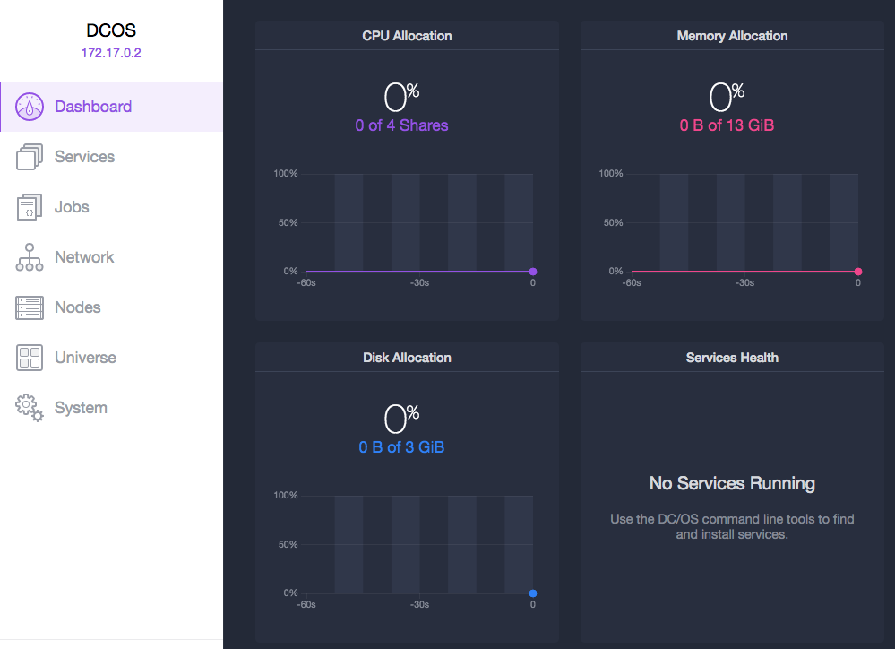
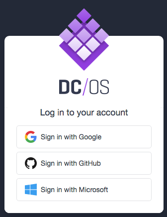
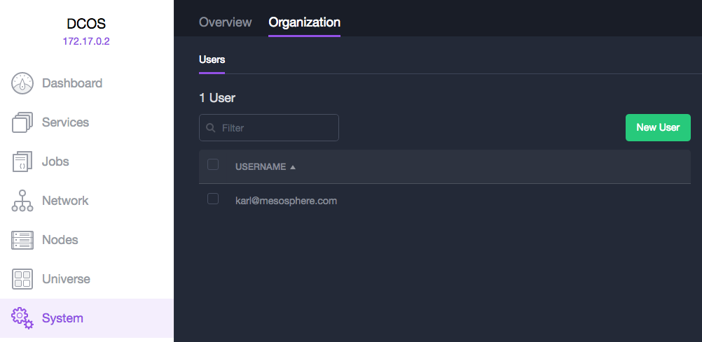
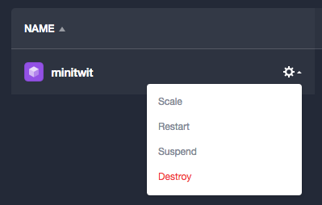

# DC/OS 101 - GUI

The DC/OS Web GUI is the primary visual control interface for observing and managing your cluster.

## Log in

1. Enter the IP of a DC/OS master node (or a master node load balancer) in a browser
1. Select a supported OAuth authorizer (Google, Github, or Microsoft)
1. Follow the authorizer specific instructions to log in

The first user to log in will have a new account created for them automatically.
Subsequent users will need to be invited by the logged in user.

## Create account

Once the first account has been created, new users must be invited by a current user.

1. Select `System` in the left navigation panel to access the system overview page
1. Select the `Organization` tab to access the user list page
1. Select `New User` to open the user invite screen
1. In the `Email` field, enter the OAuth-compatible email of the new user
1. Select `Add User` to create the user account and send an invitation email

## Create a service

Install MinitTwit as a DC/OS Service.

1. Select `Services` in the left navigation panel to access the service list page
1. Select `Deploy Service` to open the service creation screen
1. On the `General` tab, enter a service `ID` unique to the cluster (e.g. `minitwit`)
1. On the `General` tab, enter the amount of `Memory` to allocate to the service (e.g. `256`)
1. On the `Container Settings` tab, enter the name or url of a `Container Image` (e.g. `karlkfi/minitwit`)
1. On the `Network` tab, under `Network Type`, select `Bridge` to enable mapping container ports to host ports
1. On the `Network` tab, under `Service Endpoints`, enter the `Container Port` used by the service container (e.g. `80`)
1. On the `Optional` tab, under `Accepted Resource Roles`, enter `slave_public` to constrain deployment to public nodes
1. In JSON Mode, under `container.docker.portMappings[0]`, add `"hostPort": 80,` to specify which host port to use
1. In JSON Mode, add `"requirePorts": true,` so that the service will only be deployed to nodes that have the specified host port available.
1. Select `Deploy` to deploy the service

## Locate service endpoint

1. Select `Services` in the left navigation panel to access the service list page
1. Select the name of the deployed service (e.g. `minitwit`) to access the service detail page
1. Select the `Task ID` of the task with status `Running` to access the task detail page
1. Select the first link in the `Endpoints` list to access the service itself

## Destroy service

1. Select `Services` in the left navigation panel to access the service list page
1. Hover over the name of the deployed service (e.g. `minitwit`) to show the service actions button
1. Select the service actions button to show a dropdown of service actions
1. Select `Destroy` to destroy the service and its tasks

