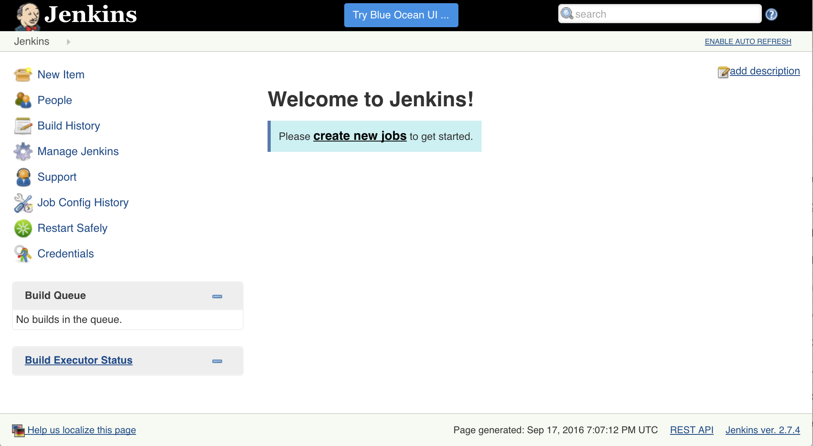

# Jenkins 101 - Quickstart

## Install Jenkins

Jenkins is available to install from the Mesosphere Universe DC/OS package repository.

This version of Jenkins is configured specifically to act as a DC/OS scheduler. It can create Jenkins agents on demand, running in docker containers. This makes new agent provisioning MUCH faster than the standard methods of manual bare-metal provisioning or automatic virtual machine provisioning.

Like all Universe packages, Jenkins may be installed with either the DC/OS GUI or CLI.

By default, the Jenkins package uses a temporary storage directory, meaning no state will be saved if it crashes, is upgraded, or its machine dies.

To ensure that state is recoverable on process termination & resurrection (but not node loss), set `storage.host-volume` to mount a host volume and `storage.pinned-hostname` to constrain the service to a single node IP hostname (or IP).

If sharing a DC/OS cluster, make sure to use unique values to avoid collision with other Jenkins installations.

To install Jenkins with the DC/OS CLI:

```
# select a private agent node hostname to pin too
$ NODE_HOSTNAME="$(dcos node --json | jq -r '.[] | select(.attributes.public_ip != "true") | .hostname' | tail -1)"

# create package config file
$ cat > pkg-jenkins.json << EOF
{
  "service": {
    "name": "jenkins"
  },
  "storage": {
    "host-volume": "/mnt/jenkins_data",
    "pinned-hostname": "${NODE_HOSTNAME}"
  }
}
EOF

# install package
$ dcos package install jenkins --options=pkg-jenkins.json
```

Once installed, running, and ready, the Jenkins GUI may be reached through the admin router at `http://${DCOS_ADDRESS}/service/jenkins/`.



## Create Jenkins project

Jenkins has many different types of projects for different kinds of builds and pipelines.

The simplest type is a "freestyle" project.
Freestyle project most often use custom shell scripts to execute standalone builds.
However, in most use cases there are several stages necessary to full tests a project.

One of the most common uses for freestyle projects is to perform tests on code that has been committed to a source repository (SCM). This is the most basic type of continuous integration.

For this lab, we'll be making a freestyle job to build MiniTwit.


1. Select `New Item` in the left nav to open the project creation page
1. Enter a project name into the test field (e.g. `minitwit-build`)
1. Select `Freestyle` and `OK` to create the project and open the job configuration page


1. Under `Source Code Management`, select Git to show the SCM section
1. Under `Repositories`, enter a `Repository URL` (e.g. `http://github.com/karlkfi/minitwit`)
1. Under `Build`, select `Add build step`, then `Execute shell`
1. Under `Execute shell`, enter a build command:

    ```
    docker build -t karlkfi/minitwit .
    ```
1. Select `Save` to confirm config changes and open the project detail page

Now that the pipeline is configured, it can be run!

1. Select `Build Now` in the left nav to add a build to the queue

    The build should immediately show up under `Build History`.
    Once the build has started, a progress bar will appear next to the build number in the build history.
1. Select the progress bar to open the build console log
1. Watch the log tail until it completes - SUCCESS!

